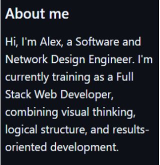

<!-- About me -->

<table width="100%">
  <tr>
    <td></td>
    <td></td>
    <td>
       
      
    </td>
  </tr>
</table>

<!-- Main -->

<h3>Learn more</h3>

I'm certified in Project Management, and deeply passionate about video game development, technological innovation, and biomechatronics. I believe in designing solutions that are as clear as they are functional—blending creativity with logic.

<!-- Skills -->
  

  
<h2>Development Toolkit</h2>

  <!-- Languages -->
  

    <strong>Languages:</strong> 
    
    
  

  <!-- Frontend -->
  

    <strong>Frontend:</strong> 
    
    
  

  <!-- Backend -->
  

    <strong>Backend:</strong> 
    
    
  

  <!-- Databases -->
  

    <strong>Databases:</strong> 
    
  

  <!-- Tools & DevOps -->
  

    <strong>Tools & DevOps:</strong> 
    
  

  <!-- CAD / Maker Tools -->
  

    <strong>Design & Maker Tools:</strong> 
    
    
  

  <!-- Project Management -->
  

    <strong>Project Management:</strong> 
    
    
    
  

  

---  

  <!-- Contat -->
  

  
<h2>Find me online</h2>

  

  

---

<!-- Footer -->

Thanks for stopping by — let’s build something great. | Powered by ☕

© 2025 Alex — This profile is public and open for creative use | [↑ Volver al inicio](#)

